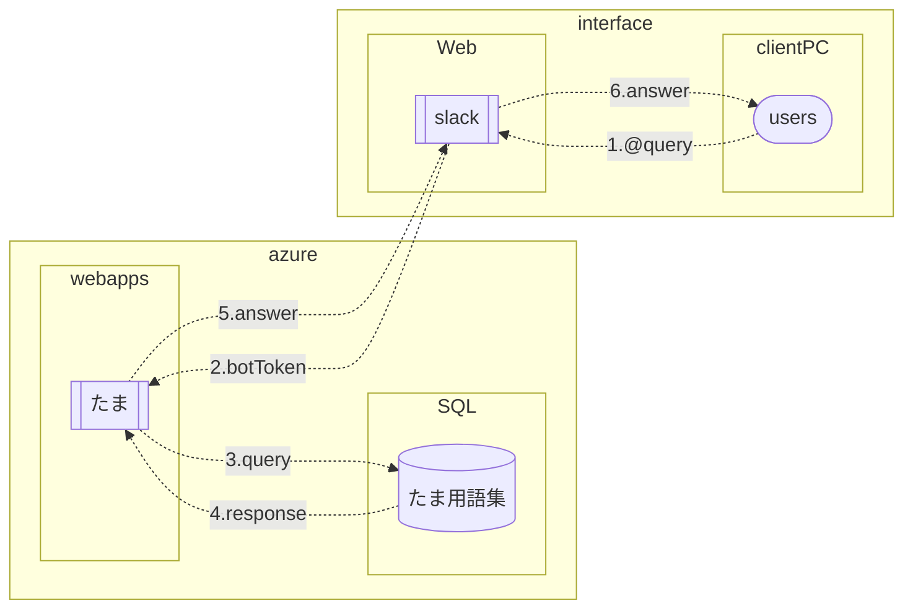
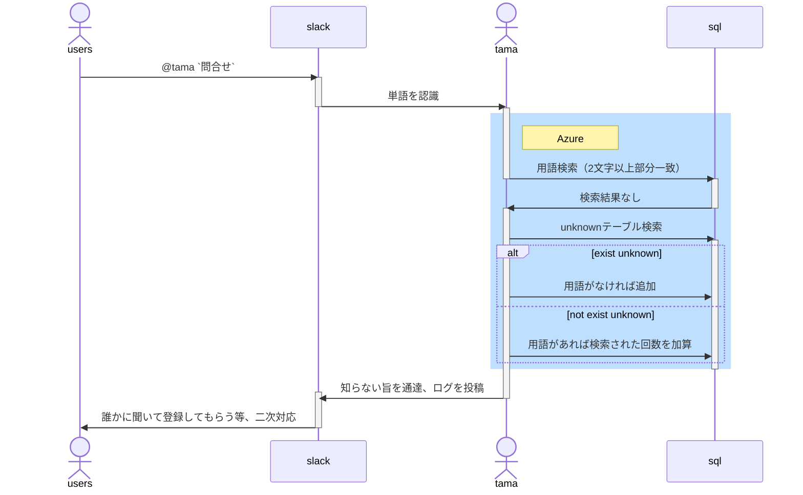

# 機能

**問合せ**

`@tama` で用語検索（2文字以上部分一致検索）

- 用語集検索、問合せ返答
- 用語がない場合には不明単語集に記録
- 用語がない場合で不明単語集に過去に記録がある場合には回数をインクレメント
- 用語がない場合にはログで不明単語が検索されたことを通達

**用語追加**

`/tama create` でモーダルが表示される

- モーダルに新規用語と新規説明を追加
- 既に存在している場合には既知であることを通達し、用語更新へ案内
- 追加された内容をログに出力

**用語更新**

`/tama update`でモーダルが表示される

- モーダルに更新用語と更新する説明内容を追加
- 不明である場合には不明であることを通達し、用語新規追加へ案内
- 更新された内容をログに出力

# **処理フロー**

Excelに答えがある場合

用語集に答えがない場合

SlackBolt

[https://slack.dev/bolt-python/concepts](https://slack.dev/bolt-python/concepts)
